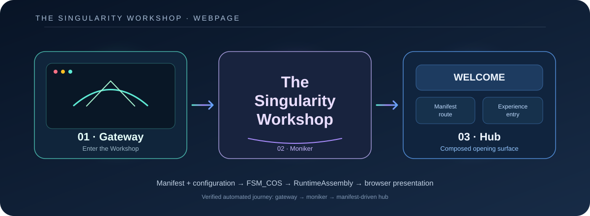
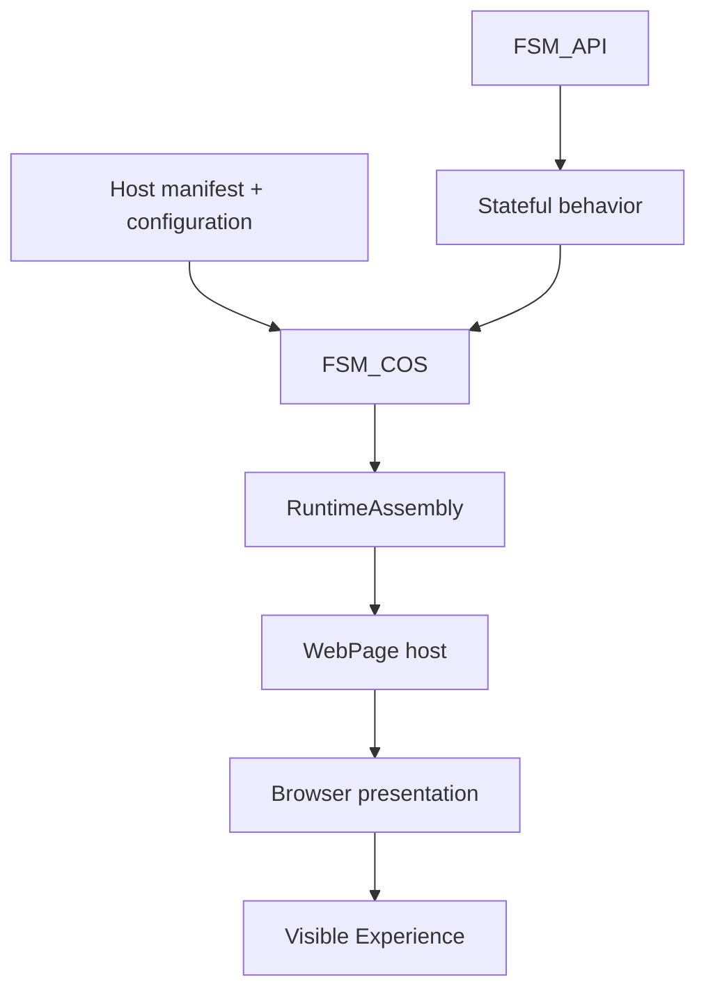

# ✳️ 00 — The Singularity Workshop: WebPage

[](https://dotnet.microsoft.com/)
[](https://github.com/TrentBest/FSM_API)
[](https://github.com/TrentBest/WebPage/actions)
[](https://codecov.io/gh/TrentBest/WebPage)



> **The page opens the door. The Experience gives you somewhere to stand. The machinery lets you look underneath it.**

WebPage is the browser host, public learning surface, and proving ground for [The Singularity Workshop](https://github.com/TrentBest). It lets people witness Workshop behavior in a browser, then follow the evidence into the code and theory.



*The intended boundary: describe the Experience in data, compose its capabilities, then let the host present the result.*

## 🟦 01 — The problem, and our response

A browser demo can easily become a second application framework: hard-coded experiences, duplicated lifecycle rules, and explanations that drift away from the running software.

WebPage is meant to prove the Workshop's reusable technology—not absorb it. The host loads its manifest and configuration, asks FSM_COS to compose the declared capabilities, and presents the result. Reusable behavior belongs in the package that owns it; browser-specific presentation belongs here.

**The guiding rule: manifest and configuration describe the request; FSM_COS composes; WebPage manifests the result.**

## 🟣 02 — How to read this repository

The Workshop's repositories explain different responsibilities. This README is the front door—not a compressed copy of every manual.

- **WebPage** explains the browser-host boundary and provides a visible integration proving ground.
- **FSM_COS** explains composition, dependency closure, arbitration, and the RuntimeAssembly handoff.
- **FSM_API** explains state-machine behavior and execution.
- **MicroBundleDomain** owns the canonical MicroBundle contract.
- Other packages document their own domains; WebPage links to their authoritative explanations instead of redefining them.

The shared [FSM_COS Documentation Standard](https://github.com/TrentBest/TheSingularityWorkshop.FSM_COS/blob/development/DOCUMENTATION_STANDARD.md) defines the Workshop README journey. This repository applies it to a browser host. Deeper explanations belong in the focused guides linked in section 05.

## 🩵 03 — The problem and solution in depth

### One request, one composition boundary

```text
host manifest + configuration
            |
            v
      WebPage host
            |
            | requests declared roots
            v
          FSM_COS
            |
            | resolves dependencies, loads, arbitrates
            v
      RuntimeAssembly
            |
            v
     WebPage presentation
            |
            v
      browser Experience
```

Think of the manifest as the itinerary, FSM_COS as the assembly crew, and WebPage as the place where the assembled result is encountered. The analogy has a limit: FSM_COS performs a concrete, tested composition operation; it is not a person making subjective choices.

| Responsibility | Owner |
|---|---|
| State-machine semantics and execution primitives | [FSM_API](https://github.com/TrentBest/FSM_API) |
| MicroBundle identity and contract | [MicroBundleDomain](https://github.com/TrentBest/TheSingularityWorkshop.MicroBundleDomain) |
| Dependency closure, loading, arbitration, convergence, RuntimeAssembly | [FSM_COS](https://github.com/TrentBest/TheSingularityWorkshop.FSM_COS) |
| Artifact discovery or persistence, where configured | Repository/provider boundary |
| Browser chrome, routes, visual presentation, WebPage-only Deep Dive | WebPage |

A host may supply a catalog that knows how to resolve available MicroBundles. That does not make the host the owner of dependency traversal or arbitration. Nor should the host build a parallel lifecycle just because it currently bridges to older presentation code.

### Current, Direction, Future

- **Current:** the host reads `webpage-host.manifest.json`; the sample declares a Workshop Moniker startup presentation and Living GUI primary Experience. The primary composition is requested through FSM_COS.
- **Direction:** make the manifest and configuration the straightforward source of host composition, and have browser presentation consume the resulting runtime without duplicating FSM_COS responsibilities.
- **Current limitation:** browser manifestation still uses transitional WebPage `PageFSM` / `LivingGuiFsm` paths. The RuntimeAssembly is real composition evidence, but it is not yet the sole authority for all visible execution.
- **Future:** additional manifest-driven Experiences and richer hub content, added when their purpose and visitor journey are clear—not as a hard-coded catalogue of speculative features.

Old experiments are evidence, not automatic architecture. Preserve behavior with tests before removing a transitional implementation.

## 🟢 04 — See it in a minute

This is the shortest local path to the browser-host proof. It assumes the [.NET 8 SDK](https://dotnet.microsoft.com/download/dotnet/8.0) is installed.

```bash
git clone https://github.com/TrentBest/WebPage.git
cd WebPage
git switch development
dotnet restore TheSingularityWorkshop/TheSingularityWorkshop.csproj
dotnet run --project TheSingularityWorkshop/TheSingularityWorkshop.csproj
```

Open the local URL printed by the ASP.NET Core host. The verified opening journey is **gateway → Workshop moniker → `WELCOME` hub**. The automated Chromium smoke test follows that same path in [GitHub Actions](https://github.com/TrentBest/WebPage/actions/workflows/dotnet-tests.yml); its screenshots are retained with the run's test-results artifact.

**What this proves:** the host starts, serves its Blazor boot manifest, and the opening browser journey reaches the manifest-driven hub without page-level JavaScript errors. See the [successful browser-journey run](https://github.com/TrentBest/WebPage/actions/runs/38025120464) for the current verified checkpoint.

**What it does not prove:** that every visible behavior is already driven solely by RuntimeAssembly, that every manifest entry is dynamically interchangeable, or that a public deployment is available. Those remain explicit migration and release checks. For exact current startup roots and test obligations, see [Current Vertical Slice](docs/CURRENT_VERTICAL_SLICE.md).

## 🟪 05 — Documentation and theory

Choose the guide that answers your question; the README stays an orientation and map.

- [**Learning Path**](docs/LEARNING_PATH.md) — a visitor and developer route from witnessing the Experience to inspecting its proof.
- [**Repository Map**](docs/REPOSITORY_MAP.md) — where source responsibilities live and how dependencies should point.
- [**Current Vertical Slice**](docs/CURRENT_VERTICAL_SLICE.md) — the current manifest, startup sequence, known gap, and proof obligations.
- [**FSM_COS Usage**](docs/FSM_COS_USAGE.md) — how WebPage requests composition and consumes the RuntimeAssembly.
- [**Workshop Runtime Architecture**](docs/WORKSHOP_RUNTIME_ARCHITECTURE.md) — the boundary between runtime behavior and browser host.
- [**Experience Theory**](docs/EXPERIENCE_THEORY.md) — the Workshop meaning of an Experience and how it relates to composition.
- [**Package Ecosystem**](docs/PACKAGE_ECOSYSTEM.md) — package ownership and why each external dependency is present.
- [**Usage**](docs/USAGE.md) — local setup and the host's runtime shape.
- [**Brave1 Public Demonstration**](docs/BRAVE1_PUBLIC_DEMONSTRATION.md) — the public MVP story, claim boundaries, and pre-submission checks.
- [**Documentation Index**](docs/DOCUMENTATION_INDEX.md) — the broader guide catalogue.
- [**Documentation Standard**](docs/DOCUMENTATION_STANDARD.md) — how WebPage applies the shared Workshop documentation rules.

Canonical external documentation: [FSM_COS](https://github.com/TrentBest/TheSingularityWorkshop.FSM_COS), [FSM_API](https://github.com/TrentBest/FSM_API), and [MicroBundleDomain](https://github.com/TrentBest/TheSingularityWorkshop.MicroBundleDomain).

---

## Architecture in one minute

**The host is not the machinery.**

```text
Experience       = what is being composed
MicroBundle      = a focused capability
FSM_COS          = composition and RuntimeAssembly
FSM_API          = state-machine behavior
WebPage          = browser presentation and proving ground
```

When a capability becomes reusable, move its implementation and authoritative documentation to its owning package, prove the integration here, and remove duplication only after equivalent behavior is tested.

## Build and verify

```bash
dotnet restore TheSingularityWorkshop/TheSingularityWorkshop.csproj
dotnet build TheSingularityWorkshop/TheSingularityWorkshop.csproj --no-restore
dotnet test SingularityHub.Tests/SingularityHub.Tests.csproj
dotnet test Experiences/LivingGuiExperience.Tests/LivingGuiExperience.Tests.csproj
dotnet test Experiences/PongExperience.Tests/PongExperience.Tests.csproj
```

These commands are the local build/test path; use [GitHub Actions](https://github.com/TrentBest/WebPage/actions) for the repository's CI result. A README command is not a substitute for checking the current CI status.

## Development and release discipline

- `development` is the active integration branch; `master` is the stable promotion target.
- Keep the persistent branch model to those two branches; short-lived work should be merged or discarded and then removed.
- Do not publish NuGet packages or deploy a release without explicit approval.
- Architecture claims require tests or observable behavior. Visual claims require visual evidence; performance claims require measurements.
- Keep documentation aligned with the code, and distinguish current behavior from migration direction and future intent.

> **Can a visitor experience it, can a developer understand it, and can the architecture tell us who owns it?**

---

*This way leads to the Singularity.*

*Built by The Singularity Workshop.*
